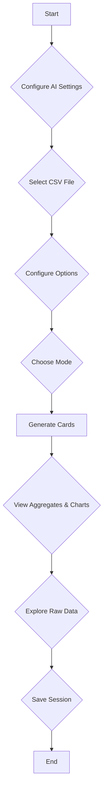

# AI-Powered CSV Analysis and Visualization Tool

This is a powerful, client-side CSV analysis tool that allows you to upload a CSV file and automatically generate aggregates, charts, and a data table. It features both automatic and manual modes for data analysis, a variety of chart types, and a history system to save and load your analysis sessions. The application is designed with a modular architecture and leverages AI to provide intelligent insights and streamline the data analysis process.

## Demo

https://yapweijun1996.github.io/AI-CSV-Chart/

## Preview


## Core Features

-   **Advanced CSV Parsing**: Upload CSV files with automatic delimiter detection. The application uses a web worker for parsing to ensure the UI remains responsive, even with large files. This allows for a smooth user experience when working with large datasets.
-   **Intelligent Data Profiling**: The application profiles your data to infer column types (number, date, string) and roles (metric, dimension, ID), with specialized logic for ERP data patterns. This automated process saves time and reduces the need for manual configuration.
-   **AI-Powered Analysis**: In "Auto" mode, the application uses an AI-driven workflow to generate up to 10 aggregates and charts, complete with natural language explanations. This feature provides users with instant insights and a starting point for their analysis.
-   **Multi-Language Support**: Select from 20 languages for the AI's responses, making the analysis accessible to a global audience. This feature enhances the user experience for non-English speakers and promotes inclusivity.
-   **Interactive Visualizations**: The application uses **Chart.js** to generate a variety of interactive charts, including bar charts, line charts, pie charts, and more. Users can customize the charts and download them as PNG images.
-   **Comprehensive Data Table**: View the raw data in a searchable and sortable table with pagination and the ability to download filtered data. This feature provides users with a familiar and intuitive way to explore their data.
-   **Persistent History**: Save your analysis sessions and load them later. The history is stored in your browser's **IndexedDB**, ensuring that your work is preserved across sessions. This feature allows users to pick up where they left off and compare different analysis sessions.
-   **AI Explanations & Summary**: With a Gemini API key, get per-card natural language explanations and an executive AI summary synthesizing insights across charts. This feature provides users with a deeper understanding of their data and helps them communicate their findings to others.
-   **AI Analysis Chat**: Ask free-form questions about the current dataset and charts; responses are grounded in the active analysis context. This feature allows users to interact with their data in a conversational way and get answers to their specific questions.

## Getting Started

To get started with the project, follow these steps:

1.  **Clone the Repository**:
    ```bash
    git clone https://github.com/your-username/ai-csv-chart.git
    ```
2.  **Navigate to the Project Directory**:
    ```bash
    cd ai-csv-chart
    ```
3.  **Serve the Application**:
    -   You can use any static file server to run the application. For example, you can use Python's built-in HTTP server:
        ```bash
        python -m http.server 8000
        ```
4.  **Open the Application**:
    -   Open your web browser and navigate to `http://localhost:8000`.

## Developer Guide — Technical Deep Dive

This section explains the project architecture, data flow, and practical implementation details for developers (junior → senior). It includes quick-start tips, file responsibilities, extension points, and debugging/testing suggestions.

### Quick Start (dev)
- Open the project in your editor and serve a static host (for local file access use a simple server):
  - Example: python -m http.server 8000 (from project root).
- Open the app in a modern browser (Chrome/Edge/Safari). Use DevTools for logging and performance profiling.
- Key files to inspect first:
  - [`index.html`](index.html:1) — main UI skeleton and modal markup.
  - [`ai_chart_api.js`](ai_chart_api.js:1) — AI request logic and retry/backoff.
  - [`ai_chart_ai_settings_handlers.js`](ai_chart_ai_settings_handlers.js:1) — settings UI and localStorage integration.

### Core Architectural Principles (concise)
- Client-side processing: parsing, profiling, aggregation and rendering all run in-browser for privacy and simplicity.
- Modular ESM code: functionality is split into focused modules to keep surface area small and testable.
- Async-first design: file I/O, worker comms, IndexedDB, and network calls use async/await.
- Web worker for parsing: CSV parsing occurs in a worker to avoid UI jank.

### High-Level Data Flow (steps + code pointers)
1. File upload → parsing
   - UI: [`index.html`](index.html:1) handles file selection, parsing options, and event wiring directly in a module script.
   - Worker: [`ai_chart_parser_worker.js`](ai_chart_parser_worker.js:1) (PapaParse-backed) streams rows to the main thread; the UI falls back to main-thread parsing if the worker is unavailable.
   - Storage: parsed rows are written to IndexedDB via [`ai_chart_store.js`](ai_chart_store.js:1).

2. Profiling → plan generation
   - Profiling: [`ai_chart_profile.js`](ai_chart_profile.js:1) inspects columns (functions: `inferType`, `inferRole`).
   - AI call: [`ai_chart_api.js`](ai_chart_api.js:1) sends a prompt containing the profile; receives an "analysis plan" JSON.

3. Task execution → charts + explanations
   - Task manager: [`ai_chart_task_manager.js`](ai_chart_task_manager.js:1) provides a lightweight workflow/todo tracker to visualize progress and status.
   - Aggregations: implemented in [`index.html`](index.html:1) as pure functions (for example, groupAgg, deduplicateJobs, autoBucket) with ERP-aware helpers in [`ai_chart_erp_logic.js`](ai_chart_erp_logic.js:1) and [`ai_chart_erp_metrics.js`](ai_chart_erp_metrics.js:1).
   - Visualization: charts rendered with Chart.js; explanations rendered using Marked.js.

4. UI / persistence
   - UI handlers: implemented directly in [`index.html`](index.html:1) (module script). Layout and UX helpers live in [`ai_chart_masonry.js`](ai_chart_masonry.js:1), [`ai_chart_section_toggle_logic.js`](ai_chart_section_toggle_logic.js:1), and the toast system [`ai_chart_toast_system.js`](ai_chart_toast_system.js:1).
   - Session persistence: [`ai_chart_store.js`](ai_chart_store.js:1) saves sessions and chunked CSV to IndexedDB.

### File Responsibility Reference
- [`index.html`](index.html:1) — Main app module: UI wiring, parsing/aggregation orchestration, chart/table rendering, AI chat/summary hooks.
- [`ai_chart_parser_worker.js`](ai_chart_parser_worker.js:1) — Background CSV parsing worker (PapaParse) with streaming/progress and fallback logic.
- [`ai_chart_store.js`](ai_chart_store.js:1) — IndexedDB abstraction (save/load sessions, chunked dataset storage).
- [`ai_chart_profile.js`](ai_chart_profile.js:1) — Data profiling heuristics (infer types/roles, temporal/hierarchy detection).
- [`ai_chart_erp_logic.js`](ai_chart_erp_logic.js:1) — ERP-specific analysis heuristics and prioritized plan hints.
- [`ai_chart_erp_metrics.js`](ai_chart_erp_metrics.js:1) — ERP metric selection/prioritization helpers.
- [`ai_chart_api.js`](ai_chart_api.js:1) — Gemini API integration and `fetchWithRetry` with exponential backoff and jitter.
- [`ai_chart_task_manager.js`](ai_chart_task_manager.js:1) — Workflow/todo manager for analysis steps, API call tracking, progress UI.
- [`ai_chart_masonry.js`](ai_chart_masonry.js:1) — Masonry-like card layout utilities.
- [`ai_chart_section_toggle_logic.js`](ai_chart_section_toggle_logic.js:1) — Collapsible section toggles and accessibility.
- [`ai_chart_toast_system.js`](ai_chart_toast_system.js:1) — Toast notifications.
- [`ai_chart_ai_settings_handlers.js`](ai_chart_ai_settings_handlers.js:1) — Settings modal logic; localStorage keys: `gemini_api_key`, `gemini_model`, `ai_language`.
- [`ai_chart_style.css`](ai_chart_style.css:1) — Core styles.
- [`ai_chart_workflow.css`](ai_chart_workflow.css:1) — Enhanced workflow/agent UI styles.

### Extension Points & Typical Changes
- Adding models or instruction templates:
  - Edit [`ai_chart_api.js`](ai_chart_api.js:1): centralize prompt templates, language injection, and retry/backoff behavior.
- Custom aggregation logic:
  - Modify aggregation helpers in [`index.html`](index.html:1) (e.g., groupAgg/autoPlan) and, if needed, extend profiling in [`ai_chart_profile.js`](ai_chart_profile.js:1) or ERP hints in [`ai_chart_erp_logic.js`](ai_chart_erp_logic.js:1).
- New chart types:
  - Update chart rendering paths and Chart.js configs in [`index.html`](index.html:1) (computeChartConfig/renderChartCard) and related styles in [`ai_chart_style.css`](ai_chart_style.css:1).

### Debugging & Performance Tips
- CPU-heavy work? Profile and move to worker. Use Chrome's Performance tab to find main-thread spikes.
- Inspect network calls to Gemini in DevTools — watch for rate-limit responses; `fetchWithRetry` handles retries but log responses for debugging.
- IndexedDB errors: wrap calls with try/catch and enable verbose logging inside [`ai_chart_store.js`](ai_chart_store.js:1).

### Cache Busting & Versioning System

This application implements a comprehensive cache-busting system to prevent browser caching issues during development and deployment. The system supports three versioning modes:

#### Versioning Modes
- **`'realtime'`**: Appends the current timestamp (e.g., `?v=1693526400000`) to all assets. Forces a reload on every page visit. Ideal for active development.
- **`'daily'`**: Appends the current date (e.g., `?v=2025-09-01`) to all assets. Forces a reload once per day. Good for production with daily updates.
- **Static string**: Uses a fixed version number (e.g., `?v=1.0.2`). Manual control for production releases.

#### How to Configure Versioning
Edit the `VERSION_MODE` constant in [`index.html`](index.html:10):
```javascript
const VERSION_MODE = 'daily'; // Change to 'realtime', 'daily', or a static string like '1.0.2'
```

#### What Gets Versioned
The system automatically applies versioning to:
- **ES6 Modules**: All `import` statements are handled via an import map in [`index.html`](index.html:50-55)
- **Non-module Scripts**: Chart.js, PapaParse, Marked.js via `document.write()` in [`index.html`](index.html:68-74)
- **Stylesheets**: Main CSS file via `document.write()` in [`index.html`](index.html:68-74)
- **Web Workers**: Parser worker instantiation in [`ai_chart_engine.js`](ai_chart_engine.js:286-290)
- **Worker Scripts**: PapaParse loading inside the worker in [`ai_chart_parser_worker.js`](ai_chart_parser_worker.js:9-13)
- **Dynamic CSS**: Workflow stylesheets in [`ai_chart_ui_workflow.js`](ai_chart_ui_workflow.js:649-652)

#### Technical Implementation
- **Import Maps**: Modern browser feature that remaps module specifiers to versioned URLs
- **IIFE Wrapper**: Versioning logic is wrapped in an immediately invoked function expression (IIFE) to avoid global pollution
- **URL Constructor**: Uses `new URL()` with `import.meta.url` for reliable relative path resolution
- **SearchParams API**: Appends version parameters using `URLSearchParams`

#### Benefits
- **Zero Configuration**: Once `VERSION_MODE` is set, all assets are automatically versioned
- **Centralized Control**: Single constant controls versioning for the entire application
- **Browser Compatibility**: Uses modern APIs with fallbacks for older browsers
- **Development Friendly**: Easy switching between development and production modes

### Testing & Validation
- Manual tests:
  - Use small and large CSV samples to validate streaming parsing and UI responsiveness.
  - Create edge-case CSVs (missing headers, mixed types) to verify `inferType`/`inferRole`.
- Unit / smoke tests:
  - Modules are plain JS — extract pure functions (profiling, aggregation) and test with Jest or similar.
- Integration tests:
  - Run the app in a headless browser (Puppeteer) to exercise the UI flows end-to-end.

### Security & Privacy Notes
- All processing is client-side; the only external dependency is the Gemini API request (requires a user-provided API key).
- Do not commit API keys. Keys are stored in `localStorage` by design — document this to users and teams.

### Recommended Onboarding Steps for New Contributors
1. Run the app locally and open DevTools.
2. Trace a full flow: upload CSV → profile → generate cards. Observe logs.
3. Inspect the prompt sent to Gemini in [`ai_chart_api.js`](ai_chart_api.js:1) to understand how the AI plan is requested.
4. Modify a small module (e.g., add a logging statement in [`ai_chart_profile.js`](ai_chart_profile.js:1)) and test.

### Summary
This project is intentionally modular and approachable. For quick contributions: focus on small, well-scoped changes (profiling heuristics, chart templates, or small UI improvements). For larger features, update the plan generation or task execution layers, and add unit tests for pure logic.

## How to Use

1.  **Configure AI Settings**: Click the robot icon (🤖) in the sidebar to open the AI Settings modal. Enter your Gemini API key, select a model, and choose a response language.
2.  **Select a CSV File**: Click the "Select CSV File" button to upload your CSV file.
3.  **Configure Options**: Set the delimiter, header, and date format options as needed.
4.  **Choose a Mode**:
    *   **Auto**: The application will automatically analyze your data and generate aggregates and charts.
    *   **Manual**: You can define column roles and create custom aggregates.
    *   **AI Agent**: Uses advanced AI to intelligently analyze data and create comprehensive analysis plans. Features dynamic task loading, progress tracking with real-time updates, and API call statistics for transparent workflow monitoring.
5.  **Generate Cards**: Click the "Generate Cards" button to create the aggregates and charts.
6.  **Interact with the Data**:
    *   View the aggregates and charts in the "Aggregates" section.
    *   Explore the raw data in the "Raw Data" table, including row-level include/exclude controls that immediately update aggregates.
    *   Use per-card filters (Min Group Share/Value) and Missing group-key toggles to refine results.
    *   Save your session using the "Save as New" button or update an existing session with "Update Report".
    *   Load previous sessions from the history sidebar (with search, rename, bulk delete, and clear-all).
7.  (Optional) **AI Outputs**:
    *   When an API key is set, each card can include an AI Explanation.
    *   The page can render a final AI Summary across all aggregates.
    *   An AI Analysis Chat is available for asking questions grounded in your current charts and data. Features context status indicators, detailed context breakdown (charts count, AI explanations, AI summary, dataset info), and context refresh functionality for up-to-date analysis.

## Workflow Diagram



## Technologies Used

-   **HTML5**: The standard markup language for creating web pages and web applications.
-   **CSS3**: The latest evolution of the Cascading Style Sheets language, used for describing the presentation of a document written in a markup language.
-   **JavaScript (ESM)**: The programming language of the web, used to create interactive effects within web browsers.
-   **Chart.js**: A simple yet flexible JavaScript charting library for designers and developers.
- **PapaParse**: A powerful, in-browser CSV parser for the web.
- **Marked.js**: A low-level compiler for parsing Markdown without caching or blocking for long periods.
- **IndexedDB**: A transactional database system, like an SQL-based RDBMS, but with a JavaScript-based object-oriented API.

## Business Use and Licensing

This project is a powerful, client-side tool ideal for business intelligence, data analysis, and reporting. Its modular design and AI capabilities make it a valuable asset for any organization looking to derive insights from their data.

### Business Applications

-   **Internal Data Analysis**: Empower your teams to analyze sales data, marketing campaigns, and operational metrics without the need for complex software.
-   **Client Reporting**: Quickly generate and share insightful reports with clients, complete with charts and AI-generated explanations.
-   **Prototyping and Demos**: Use the tool to prototype data-driven features or demonstrate the power of AI in data analysis.

### Licensing

This project is built using open-source libraries, all of which are under the **MIT License**. This permissive license allows for:

-   **Commercial Use**: You can use, modify, and distribute this application for commercial purposes without any fees or royalties.
-   **Private Use**: You are free to use and modify the application for your own purposes.
-   **Distribution**: You can distribute the original or modified versions of the application, as long as you include the original copyright and license notice.

This makes the project a safe and flexible choice for business use, with no restrictive licensing to worry about.
